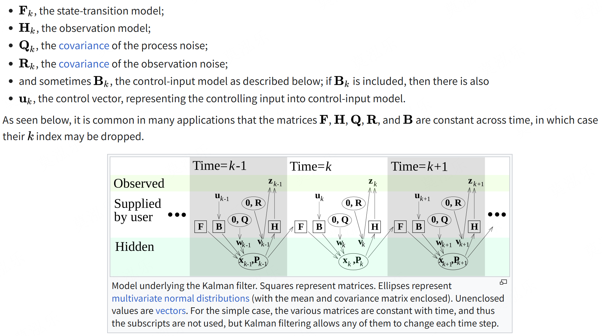
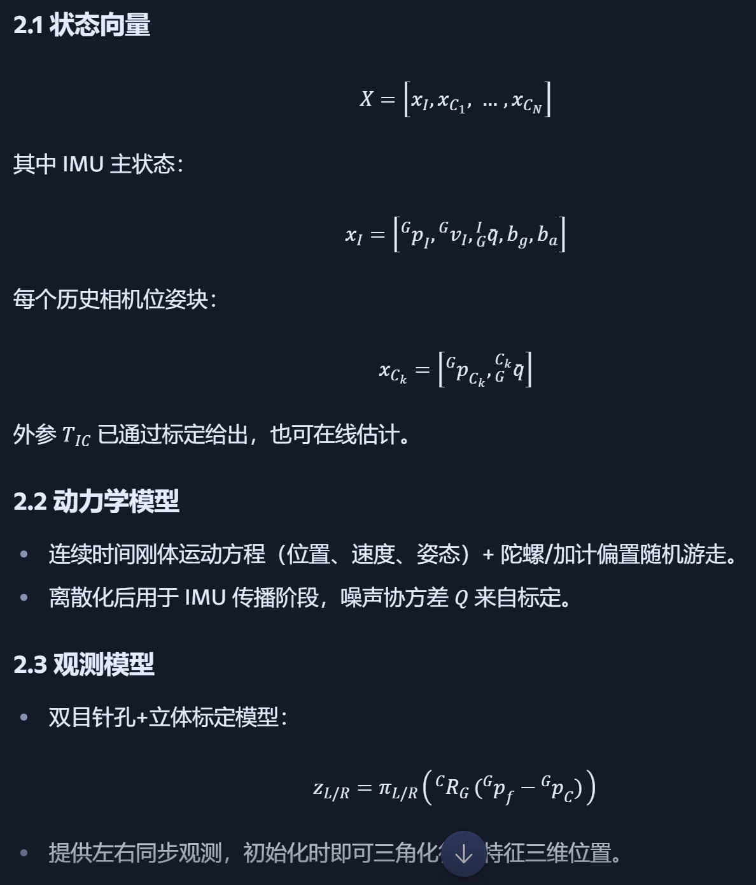
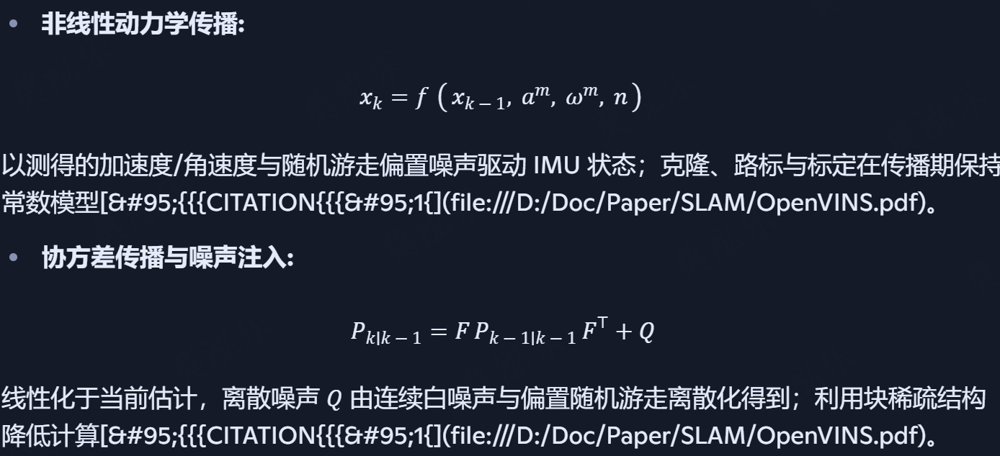
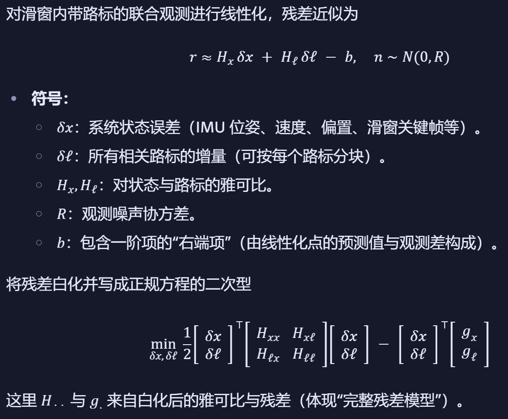

# Preliminary
## Kalman Filter
Kalman Filter 是一种最小均方误差估计器（MMSE Estimator），它会在 预测值 和 传感器测量值 之间取一个加权平均，权重由各自的“不确定性”决定，从而得到比单独测量或预测更精确的系统状态估计

### 符号表示
- $\mathbf{x}$ 状态向量
- $\mathbf{F}$ 状态转移矩阵，状态 -> 状态。线性方程KF中为常数矩阵，非线性系统EKF中为对状态方程对状态的一阶偏导
- $\mathbf{Q}_{k}$ 状态过程噪声协方差
- $\mathbf{P}_{k|k}$ 后验状态估计协方差
- $\mathbf{H}$ 观测转移矩阵, 状态 -> 观测。线性系统KF中为常数矩阵；非线性系统EKF中为观测方程对状态的一阶偏导
- $\mathbf{R}_{k}$ 观测噪声协方差
- $\mathbf{B}$ 控制输入矩阵，输入 -> 状态

公式:
$$ \mathbf{x}_{k} = \mathbf{F}_k \mathbf{x}_{k-1} + \mathbf{B}_k \mathbf{u}_{k} + \mathbf{w}_k $$

其中 $\mathbf{w}_k$ 为过程高斯噪声，其服从分布 $N(0, \mathbf{Q}_k)$

k时刻的观测，可以表示为
$$ \mathbf{z}_k = \mathbf{H}_k \mathbf{x}_k + \mathbf{v}_k $$

其中 $\mathbf{v}_k$ 为过程高斯噪声，其服从分布 $N(0, \mathbf{R}_k)$

### 预测
1. 计算预测先验状态：状态转移 \* 前一刻 + 控制转移 \* 用户输入
$$ \hat{\mathbf{x}}_{k|k-1} = \mathbf{F}_k \hat{\mathbf{x}_{k-1|k-1}} + \mathbf{B}_k \mathbf{u}_k $$
2. 计算预测状态协方差：状态转移 \* 前一刻协方差 * 状态转移T + 状态过程协方差
$$ \mathbf{P}_{k|k-1} = \mathbf{F}_k \mathbf{P}_{k-1|k-1} \mathbf{F}^{\mathrm{T}}_k + \mathbf{Q}_k $$

### 更新
1. 计算预拟合残差：观测 - 观测转移矩阵 \* 先验状态
$$ \tilde{\mathbf{y}}_k = \mathbf{z}_k - \mathbf{H}_k \hat{\mathbf{x}}_{k|k-1} $$

2. 计算预拟合残差协方差：观测转移矩阵 \* 预测状态协方差 \* 观测转移矩阵T + 观测噪声协方差
$$ \mathbf{S}_k = \mathbf{H}_k \mathbf{P}_{k|k-1} \mathbf{H}^{T}_k + \mathbf{R}_k $$

3. 计算最优卡尔曼增益：预测状态协方差 \* 观测转移矩阵T \* 预拟合残差协方差-1
$$ \mathbf{K}_k = \mathbf{P}_{k|k-1} \mathbf{H}^{T}_k \mathbf{S}^{-1}_k $$

4. 更新后验状态：先验状态 + 卡尔曼增益 \* 预拟合残差
$$ \hat{\mathbf{x}}_{k|k} = \hat{\mathbf{x}}_{k|k-1} + \mathbf{K}_k \tilde{\mathbf{y}}_k $$

5. 更新后验状态协方差：（单位阵 - 卡尔曼增益 \* 观测转移矩阵）预测状态协方差
$$ \mathbf{P}_{k|k} = (\mathbf{I} - \mathbf{K}_k \mathbf{H}_k) \mathbf{P}_{k|k-1} $$

6. 测量残差：观测 - 观测转移矩阵 \* 后验状态
$$ \tilde{\mathbf{y}}_{k|k} = \mathbf{z}_k - \mathbf{H}_k \hat{\mathbf{x}}_{k|k} $$

## EKF
实际情况下状态转移和观测模型是非线性的：
$$ x_k = f(x_{k-1}, u_{k-1}) + w_{k-1} $$
$$ z_k = h(x_{k}) + v_k $$

其中 $f$ 根据先前的估计值计算预测状态，函数 $h$ 根据预测状态计算预测观测值。$f$ 和 $h$ 不能直接应用于协方差。取而代之的是计算偏导数矩阵（Jacobian矩阵）。

### 公式差异
预测估计状态：
$$ \hat{\mathbf{x}}_{k|k-1} = f(\hat{\mathbf{x}}_{k-1|k-1}, \mathbf{u}_k) $$

计算预拟合残差：
$$ \tilde{\mathbf{y}}_k = \mathbf{z}_k - h( \hat{\mathbf{x}}_{k|k-1} ) $$

状态转移矩阵：
$$ F_k = \frac{\partial f}{\partial x} _{\hat{\mathbf{x}}_{k-1|k-1}, \mathbf{u}_k} $$

观测转移矩阵：
$$ H_k = \frac{\partial h}{\partial x} _{\hat{\mathbf{x}}_{k|k-1}} $$

每一步需要更新状态转移和观测转移矩阵

# MSCKF

Multi‑State Constraint Kalman Filter

- 在状态向量中维护一个滑动窗口的多帧相机位姿，不直接估计特征三维位置
- 利用同一特征跨多帧观测形成的几何约束，直接更新这些历史位姿，从而既保留长期关联信息，又避免状态膨胀

## 模型
- EKF主状态：IMU 15 维演化状态 + 最多N帧历史相机位姿
    - 15维：四元数位姿 $^{I}_{G}\bar{q}$、速度 ${}^{G}\mathbf{v}_{I}$、位置 ${}^{G}\mathbf{p}_{I}$、陀螺仪偏置 $\mathbf{b}_g$、加速度计偏置 $\mathbf{b}_a$
    - N*6：姿态 $^{C_i}_{G}\bar{q}$、位置 ${}^{G}\mathbf{p}_{C_i}$
- 误差状态：最小三维角扰动 + 四元数误差。其余量采用加性误差模型，便于线性化与协方差传播

## 流程
1. Propagation 传播
    - 按 IMU 频率，用连续时间刚体动力学模型离散积分（Runge–Kutta）传播状态和协方差
    - 噪声项来自陀螺仪/加速度计的高斯噪声和随机游走模型，提前标定得到。

2. State Augmentation 状态扩展
- 来新图像时，将当前相机位姿复制进状态向量作为新“历史状态”
- 协方差矩阵做相应扩维，初始化与当前 IMU 状态高度相关的新块。

3. Update 更新
    - 对每个离开视野的特征，收集它在窗口内的所有像素观测
    - 用针孔模型线性化观测方程，建立关于该特征和相关相机位姿的测量方程
    - 当一批特征在某帧的测量可用时，将它与该特征在窗口中其它帧的观测一起组成多帧几何约束
    - 通过对这些观测进行最小二乘消元（Schur complement / null‑space projection），消去特征三维位置，得到只含相机位姿误差的观测残差
    - 这些残差进入 EKF 标准更新公式修正状态与协方差

### 方程
1. 对特征点 $\mathbf{p}_f$ 在第 $i$ 帧的归一化像平面观测： $$ \mathbf{z}{i} = h( \mathbf{x}{C_i}, \mathbf{p}_f ) + \mathbf{n} $$
2. 针孔模型线性化后得到关于位姿误差与特征位置误差的联合线性测量方程。把同一特征的多帧观测打包，将该特征在滑窗内所有可用观测堆叠，得到： $$ \mathbf{r} \approx \mathbf{H}_x \tilde{\mathbf{x}} + \mathbf{H}_f \tilde{\mathbf{p}}_f + \mathbf{n} $$
3. 通过 $null(\mathbf{H}_f)$ 投影，消元 $\tilde{\mathbf{p}}_f$： $$ \mathbf{r}' = \mathbf{H}'_x \tilde{\mathbf{x}} + \mathbf{n}' $$ 其中 $\tilde{\mathbf{x}}$ 仅包含与这些观测相关的多帧相机位姿与 IMU 误差子向量
4. 用$(H', r')$ 执行卡尔曼增益、状态修正与约瑟夫式协方差更新；对每个“出窗”特征一次性处理其所有观测，属于“延迟线性化”，可减小线性化偏差： $$ \mathbf{K} = P H'^T (H' P H'^T + R)^{-1} $$ $$ \hat{\mathbf{x}} \leftarrow \hat{\mathbf{x}} + \mathbf{K} \mathbf{r}' $$ $$ P \leftarrow (I - K H')P $$

# MSCKF VIO

原始 MSCKF 思想的双目版本重构与工程强化

## 模型

## 框架

1. 传播 Propagation
    - 按 IMU 频率积分状态与协方差，采用中值积分或四阶 Runge-Kutta 保证数值稳定
    - 同步维护历史相机位姿块的预测

2. 状态扩展 Augmentation 
    - 每到新立体帧，将当前相机位姿（由 IMU 外推并应用外参）添加到状态向量末尾
    - 协方差扩维，关联 IMU 与新位姿的误差协方差

3. 特征跟踪与管理
    - 前端用光流+立体匹配追踪特征，利用 RANSAC 基础矩阵/本质矩阵剔除外点。
    - 特征离开视野或跟踪结束即触发测量更新。

4. 测量更新（多状态约束）
    - 堆叠该特征在多个相机位姿下的观测方程
    - 通过零空间投影消去位置，得到只包含位姿误差的残差、雅可比
    - 用 EKF 更新公式修正状态与协方差

5. 滑窗管理与边缘化
    - 保持相机位姿块数量上限 ，移除最老块，释放计算资源。
    - 被移除块相关的信息已通过观测更新“压缩”到其余状态。

# OpenVINS

## 模型

状态：
$$ x_k = [x^I, x^C, x^M, x^W] $$
其中$x^I$为IMU状态，$x^C$为滑窗内相机位姿克隆，$x^M$为环境路标（可选）支持 3D、逆深度、锚定等多种表征，$x^W$为相机内参与相机-IMU 外参及时间偏移等标定量,用于在线标定

IMU状态：
$$ x^I = [ ^{I_k}_G q, ^{G}p_{I_k}, ^{G}v_{I_k}, b_g, b_a ] $$
姿态以单位四元数表示并在误差状态上更新以保持流形一致性；其余量为欧式向量空间，整体采用盒加/盒减映射进行一致的流形更新

传播：

更新：
- 零空间投影: 将同一特征的多帧像素残差按路标雅可比的零空间投影，消去路标，仅以位姿/克隆的误差进行 EKF 更新，避免路标维度膨胀并提升实时性
- 显式 SLAM 路标更新：
    - 延迟初始化: 通过分块 QR 将线性系统拆分为“含新变量/不含新变量”两部分；当路标块达到满秩，用上块做最小二乘初始化新路标及其与旧状态的相关性，再加入状态做标准 EKF 更新
    - 多表征支持: 3D 坐标、逆深度、锚定 3D 等，统一在类型系统下以稀疏雅可比接入，不改变核心滤波器结构

## 框架
- 传感输入: IMU 原始加速度/角速度流与相机图像（单目/多目）。IMU 以高频连续传播提供短时先验，相机以低频离散观测约束先验误差
- 视觉前端: 稀疏特征的检测、跨帧跟踪与（可选的）几何三角化，仅生成像素残差与（可选）少量可持久路标，避免重型前端优化
- 滤波后端: 基于流形的滑动窗口 EKF。对 IMU 做连续时间离散化传播，对视觉残差做零空间投影的 MSCKF 更新，并可混合少量显式 SLAM 路标更新
- 滑窗与克隆: 在每次相机触发时克隆当前相机位姿进状态，维持固定窗口并对最旧克隆边缘化，保留信息于先验，控制计算量
- 在线标定: 联合估计相机内参、相机-IMU 外参与相机-IMU 时间偏移，标定量以独立状态进入并通过像素残差雅可比耦合更新

## 细节
- FEJ（First-Estimates Jacobian）: 在雅可比计算中对相关线性化点使用首次估计，缓解不一致与漂移问题，提升 MSCKF/SLAM 更新的一致性与稳健性
- 误差状态 EKF: 对群变量在线性化的仅是误差（如右/左乘误差四元数），保证更新与协方差在流形上自洽
- 克隆策略: 每到相机时刻将当前相机位姿克隆进状态，形成多帧时空基线以承载跨帧约束；克隆本身不传播，仅在更新时被约束
- 窗口维持与边缘化: 当克隆数超阈，边缘化最老克隆，将其信息吸收到先验中（约束保留在协方差与先验残差里），既保留长期信息又控制计算规模
- 与 MSCKF/SLAM 的配合: MSCKF 残差主要束缚克隆链；少量显式路标跨窗长期存在，提供回访区域的稳定约束，二者互补

### 概念补充
#### 零空间投影
在 MSCKF 这类滤波式 VIO 中，如果直接把每个路标（特征点）的位置作为状态加入 EKF，状态维度会急剧膨胀，计算量和内存都会吃不消。MSCKF/OpenVINS 采用“特征不入状态”的策略——利用该特征在滑窗内多帧的观测，对这些相机位姿施加约束。

通过消除每个特征的三位坐标，使得计算量与特征数量呈线性。零空间投影不会丢掉该特征的几何信息（在当前线性化点下），等价于显式估计该特征的最优结果

#### KLT
Kanade–Lucas–Tomasi Tracker
前端需要在连续图像帧间跟踪特征点的位置，才能建立多帧观测的对应关系。OpenVINS 使用的是稀疏光流法，即 KLT

- 基于 Lucas–Kanade 光流：假设特征点周围小窗口的亮度在两帧之间保持不变，通过最小化亮度差平方和来求解亚像素级的位移向量
- Tomasi 增强：用角点检测（如 Shi–Tomasi）挑选跟踪性好的初始特征点（梯度方向丰富，光流方程可解）
- 多层金字塔：从低分辨率到高分辨率逐层细化，提高大位移场景的收敛性

# SchurVINS

明确构建完整的二次型残差模型（梯度、海森、观测协方差都显式建模），然后用 Schur 补来把高维联合问题拆成“自运动（位姿+IMU状态）”与“路标（特征三维）”两条独立的信息通道，最后在这两个通道上做高效 EKF 更新。结果是：接近优化法的精度，同时保持滤波法的效率与常数因子优势

## 模型

## 框架
### 前端（SVO2.0 集成）
- 特征对齐与深度滤波：沿用 SVO2.0 的稀疏直接法前端（patch 级对齐）与深度滤波器做初始化与短基线稳健跟踪。
- 长期跟踪策略：结合小型局部图的可见性，将局部共视关键帧的路标投影-对齐，提高重跟踪与再发现能力。
- 接口产物：提供带不确定度的像素观测与初始/更新深度，用于后端构建完整残差模型。

### 后端（滑窗 EKF 与路标求解器）
- 状态与滑窗：状态包含 IMU（位姿、速度、偏置）、相机-IMU 外参（可固定或弱约束）、以及最近若干关键帧。采用小滑窗（例如 4 帧量级）以控成本。
- 传播与更新：IMU 预积分用于传播；视觉量测经“Schur 分解后的自运动通道 + 路标通道”分别进入 EKF 更新。
- 路标模块：提供基于 EKF 的小规模路标估计器，替代传统的 GN/LBA；必要时也能退回到小 GN 步（例如初始化/退化时）。
- 边缘化：FIFO 策略维护滑窗关键帧，同时利用 Schur 消元将被移除帧/路标的信息保留在自运动信息矩阵中，避免漂移信息丢失。

### 观测管理与鲁棒性
- 门限与鲁棒核：卡方门限/马氏距离做量测拒绝；在构造二次型时可接入鲁棒核等权重，缓解外点/光照变化。
- 尺度与可观性：默认立体或有外助（如双目）更易稳定尺度；单目也可工作，但需要适当关键帧策略与深度初始化。
