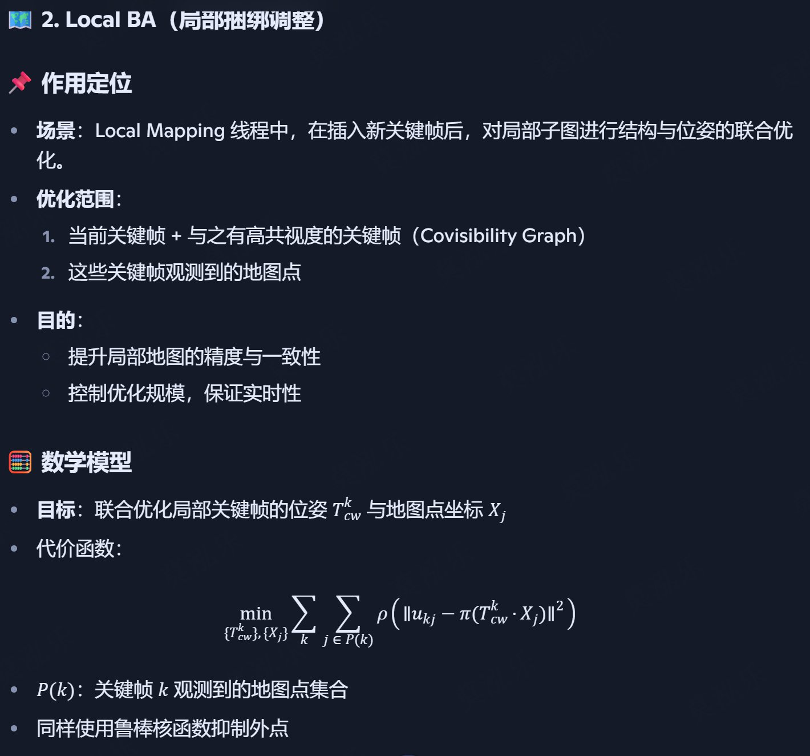

# ORB-SLAM 1

## 框架
- Tracking（跟踪前端）
  - 输入：相机图像流
  - 输出：当前帧相机位姿、关键帧插入请求
  - 方法：运动模型预测 + ORB 特征匹配 + Motion-Only BA
  - 失跟时调用全局重定位（DBoW2 词袋匹配）

- Local Mapping（局部建图）
  - 输入：新关键帧
  - 输出：更新局部地图 + 局部 BA 优化
  - 方法：三角化新地图点 → 地图点筛选 → 冗余关键帧剔除

- Loop Closing（回环检测与闭环优化）
  - 输入：新关键帧
  - 输出：闭环优化后的全局一致地图
  - 方法：DBoW2 检测 → 相似变换估计 → 地图融合 → Essential Graph 优化

## 细节

### Motion-only BA
Tracking 线程里，每到新帧输入后，需要根据初始位姿预测（运动模型）+ ORB 匹配结果来精确优化该帧的相机位姿

不优化地图点（3D点固定）; 参数量小 → 速度快，适合逐帧实时运行; 防止刚插入关键帧时对地图结构造成不稳定更新

### Local BA

### Loop Closure
1. Loop Detection
  - 特征表示：对关键帧提取 ORB 描述子，利用 DBoW2 词袋模型 离线构建的视觉词典进行量化。
  - 相似度计算：当前关键帧的词袋向量与所有关键帧（或其子集）的词袋向量计算相似度分数。
  - 候选筛选：
    - 剔除与当前帧时间上相邻的关键帧（避免误判局部相似）。
    - 保留相似度高且满足连续多帧高分的候选关键帧（减少瞬时误检）。

2. Loop Validation
  - 在候选关键帧与当前关键帧之间，通过 ORB 特征匹配找到对应点对
  - 估计相似变换 Sim(3)：
    - 因为是单目 SLAM，需要同时修正旋转、平移和尺度。
    - 使用 RANSAC 保证鲁棒性，剔除外点。

3. Loop Fusion
- 将当前关键帧及其局部地图与候选关键帧及其局部地图合并：
  - 融合重复的地图点（重复观测合并为单点）。
  - 建立新的关键帧–地图点观测连接。
- 这一步使得两段轨迹“缝合”起来。

4. Loop Correction
- Essential Graph 优化：
  - 节点：所有关键帧
  - 边：
    - 生成树边（保证全图连通性）
    - 强共视边（共视点多的关键帧对）
    - 闭环边（新检测到的闭环）
- 通过 g2o 进行 Sim(3) 图优化：
  - 修正所有关键帧位姿
  - 地图点位置同步更新

# ORB-SLAM 2

## 框架
三主线程 + 一辅助线程：

1. Tracking
  - 输入：相机帧（单目/双目/彩色+深度）
  - 特征提取：ORB（两幅图像分别提，双目为左右，RGB‑D 为彩色）
  - 位姿优化：Motion‑Only BA（单帧位姿优化）
  - 关键帧插入策略：基于近/远点跟踪数量
  - 可调用重定位模块（DBoW2）

2. Local Mapping
  - 处理新关键帧 → 三角化生成新地图点
  - 剔除冗余关键帧 / 低质量点
  - 执行 Local BA（局部关键帧+地图点联合优化）

3. Loop Closing
  - 候选回环检测（DBoW2）+ RANSAC 验证
  - Stereo/RGB‑D 模式下直接用刚体变换（消除了单目的尺度漂移问题）
  - Pose‑Graph 优化后，启动第四线程 → Full BA

4. Full BA（独立线程）
  - 全局优化所有关键帧与地图点，确保结构-运动最优解
  - 完成后通过生成树传播位姿修正，融合运行期间新加入的节点

## 特点

### 近/远点策略
在双目 / RGB‑D 中，特征点的深度精度随距离迅速下降。远处物体的视差（disparity）非常小，直接三角化会导致尺度和位移噪声很大
- 近点：
  - 深度 < 40 × 基线长度
  - 平移、尺度、旋转都有强约束
- 远点：
  - 深度 > 40 × 基线长度
  - 深度无效
  - 旋转约束强，平移/尺度贡献弱

- 充分利用近处点的精确深度 → 稳定平移与尺度估计
- 让远处点仍参与旋转估计与回环识别 → 提高鲁棒性
- 降低远距离点引入的尺度漂移风险

### 深度信息融合策略

ORB‑SLAM2 的亮点是将不同输入模式统一到 “Stereo Keypoints” 表达，这样后端完全不需要区分来自双目还是 RGB‑D 的特征：
- 双目输入：直接进行左右图匹配，亚像素精修
- RGB‑D 输入：利用深度值计算虚拟右图坐标
- 近点/远点：
  - 近点：深度 < 40 × 基线长度 → 单帧即可三角化，提供平移+尺度约束
  - 远点：深度大 → 只提供旋转约束，需多视图三角化

## 细节

### Motion-Only BA
- 相机观测模型：单目特征（2D 残差）、立体/RGB-D 特征（3D 残差，含虚拟右像素）
- 损失函数：目标函数（鲁棒核 + 金字塔尺度权重）
- 初值来源：恒速模型或前一帧位姿
- 剔除外点：优化中迭代剔除大残差匹配，收敛后重投影阈值再筛一遍
- 损失函数

### Local BA
- 优化变量：
  - 位姿：局部关键帧集合K（当前关键帧 + 共视强邻居 + 生成树子节点）可动
  - 地图点：关键帧集合K看到的点集可动
  - 固定项：边界关键帧固定但其观测参与误差
- 目标函数：

- 计算细节：
  - 使用 LM + 舍入点（Schur complement）先消去点，再解位姿，复杂度近似与局部窗口大小线性相关
  - 每插入一个关键帧即在 Local Mapping 线程触发，通常几十到几百毫秒，可与 Tracking 并行

### Loop Closure
1. Detection & Validation
  - 用词袋做回环召回，匹配候选关键帧的特征与地图点
  - 在 Stereo/RGB-D 模式下直接估计刚体约束SE(3); 单目则需相似变换Sim(3)处理尺度漂移
  - RANSAC/几何一致性检验通过后添加回环边

2. Graph
  - 节点：所有关键帧的位姿
  - 边：生成树边 + 高共视权重边（稀疏化保持刚性）+ 回环边（关键约束）
  - 损失函数：

3. 触发Full BA

### Full BA
完成回环的位姿图优化后，启动独立线程跑一次全局 BA，细化全图的结构与运动。把 Pose-Graph 的“整体一致性”进一步转化为像素级的重投影一致性
- 变量与约束：优化全体关键帧与地图点（固定一个原点关键帧以消除规范自由度），目标同 Local BA 的全图版本
- 损失函数：和Local BA一样，但是所有关键帧和点
- 实施细节：
  - 异步执行以不断图；若期间再次检测到回环，会中止当前 Full BA，先完成新回环矫正，再重启
  - 结束后通过最小生成树把位姿修正从“已优化子集”传播给优化期间新加入的关键帧与点，确保地图一致

### 实施细节
- 鲁棒核与阈值：MOBA/Local/Full BA 都应配 Huber 核；外点阈值结合金字塔尺度与相机噪声设置。
- 窗口选择：Local BA 的关键在于“共视图阈值”和“生成树子节点”的平衡，尽量稀疏但不断裂约束。
- 立体/RGB-D 的优势：使用 3D 立体残差能强约束尺度与平移，Pose-Graph 采用 SE(3) 即可，不必处理尺度漂移。

# ORB-SLAM 3
系统在 ORB‑SLAM2 和 ORB‑SLAM‑VI 的基础上，补齐 IMU 初始化、跨地图复用与无缝合并、鱼眼模型与更稳健的重定位/回环策略，形成“短‑中‑长期数据关联”的统一解法

## 框架
与 ORB-SLAM2 基本类似，着重介绍IMU部分

1. Tracking
  - 预测代替恒速模型；用上一个关键帧（或上一帧）的状态 + 预积分，直接给出当前帧的位姿/速度先验，显著缩小匹配与优化搜索空间。
  - 帧级紧耦合优化
    - 变量：当前位姿、速度、gyro/acc 偏置；因子：一条 IMU 预积分边 + 多个重投影边。
    - 结果：更稳健的位姿、在线更新偏置，减少光照/模糊/少特征引起的发散。
  - 丢跟桥接：短时间视觉丢失时，靠 IMU 预测把状态往前“拖”，提升重定位成功率与恢复速度。

2. Mapping
  - 视觉‑惯性局部 BA 窗口
    - 关键帧窗口内，所有可见地图点的重投影误差 + 相邻关键帧之间的 IMU 约束，一起优化位姿、速度、偏置与点。
    - 边界关键帧固定，既维持参考框架，又防止过度自由度导致漂移回弹。
  - 尺度与重力的持续精化：单目场景中，系统会在合适时机对尺度与重力再优化，使全局解不断收敛到物理一致。

3. LC
  - 回环约束在 SE(3) 上即可（无尺度漂移），有 IMU 的图没有全局尺度漂移，回环与合并直接在 SE(3) 上优化，收敛更快更稳。
  - 两级校正
    - 先位姿图（Essential Graph）把全局“拉直”，立刻止住大尺度漂移与航向误差；
    - 再触发 Full Inertial BA，把像素级（重投影）与动力学级（IMU）残差一起消干净。
  - 跨图合并：Atlas 多地图相遇时，通过视觉‑惯性约束对齐重力与尺度，一步合并，避免“错位拼接”

4. Full BA
把所有关键帧的位姿/速度/偏置和地图点一起做一次“像素级+惯性级”全局精修

## 特点

### 传感器与相机模型
- 传感器模式：纯视觉（单目/双目/RGB‑D）与视觉‑惯性（以上模式均可加 IMU）统一在同一优化框架中运行；双目/RGB‑D 以“立体关键点”格式输入，继承 ORB‑SLAM2 的深度融合设计。
- 相机模型：抽象相机接口将投影/反投影与雅可比解耦，原生支持针孔与鱼眼模型，并保持重定位、回环与 BA 的一致实现

### 视觉‑惯性

#### IMU 预积分
IMU 预积分与状态定义：VIO 状态含位姿、速度、陀螺与加计偏置；在相邻关键帧之间进行 IMU 预积分，形成旋转/速度/位置残差并在图优化中与视觉重投影残差联合最小化。

与视觉重投影残差共同构成最大后验（MAP）损失函数

#### 惯性初始化
引入基于最大后验（MAP）的“仅惯性”优化以初始化偏置、尺度和重力方向，再无缝切换到联合优化；相比以往方法更快更稳，便于在室内外和不同运动强度下启动

- 观测性要求: 单目+IMU需要一定的“运动激励”（变化的加速度/角速度），否则尺度与重力方向不可观
- 典型步骤
  - 陀螺偏置粗估：用短时旋转一致性最小化获取 gyro bias 初值。
  - 重力方向与尺度估计：将预积分位移/速度与视觉 SfM 的相对运动对齐，解出重力方向与全局尺度。
- 联合精化：以 MAP 方式一起优化位姿、速度、偏置、尺度、重力，形成可交付的度量‑重力对齐状态。
- 工程策略：不够激励就“延迟初始化”，直到窗内时长、运动幅度达标；初始化成功前，系统仍以视觉主导，IMU以预测/约束辅助。

#### 运行模式
视觉‑惯性在 Tracking/Local Mapping 内同步优化位姿、速度与偏置；回环/合并后可触发全局 BA 对视觉与惯性残差一起做全图精修

#### 偏置 & 噪声
- 偏置建模：陀螺与加计偏置按随机游走（或弱先验）建模，参与所有相关优化；预积分里保留对偏置的一阶敏感度，便于快速重线性化。
- 噪声与权重：视觉残差用鲁棒核抗外点；IMU 残差基于连续‑离散噪声映射得到的协方差加权，避免以“硬约束”破坏视觉信息。
- 退化与保护：纯转、匀速等退化运动会削弱观测性；系统通过运动检测延后初始化、限制尺度更新、或临时减弱 IMU 权重来自保。

#### 应用
如果你在单目+IMU下总“起不来”，先看两件事：
1. 窗口内是否有足够“激励”（加速度/角速度在多个方向变化）；
2. IMU 噪声、偏置随机游走参数是否与设备量级匹配（过小会“压死”视觉，过大则 IMU 约束虚弱）。

先把 Tracking 的帧级紧耦合“稳住”，再逐步放开 Local/Full BA 的权重与窗口，收敛会顺滑很多。