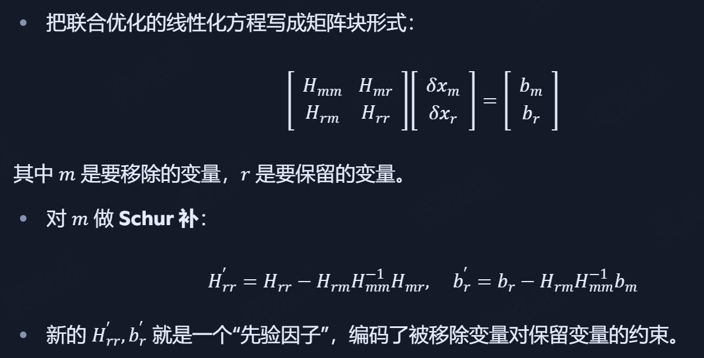
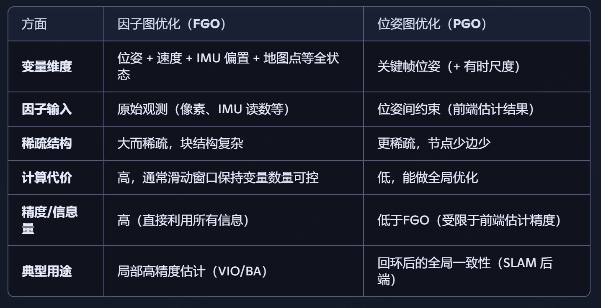
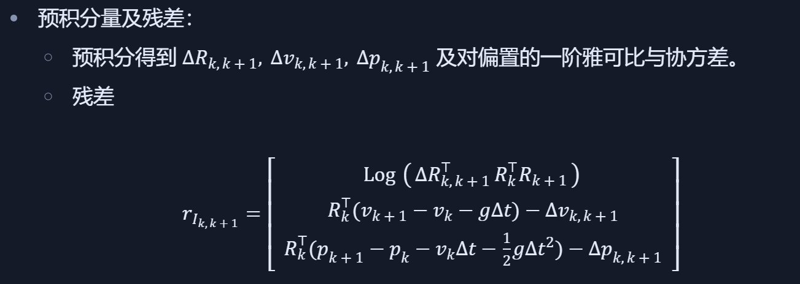

# VINS-Mono

## Preliminary

对于VINS-Mono

### 因子图 Factor Graph Optimization
#### 概念
- 本质：一个概率图模型，用来表达“状态变量之间由哪些观测产生了约束”。
- 节点（变量结点）：你要估计的未知量，比如每帧的相机/IMU位姿 T 、速度 v、IMU 偏置 b_g, b_a、地图点的逆深度等。
- 因子（factor）：代表某个测量带来的约束，比如：
  - 视觉重投影因子：锚帧与当前帧对同一个特征点的观测。
  - IMU 预积分因子：相邻两帧 IMU 测量综合起来对位置/速度/姿态的约束。
  - 先验因子：历史信息压缩成的“虚拟观测”。
  - 回环因子：闭环匹配形成的相对位姿约束。

#### 数学形式
每个因子就是一个残差函数，描述测量与当前状态的差异。联合优化目标是最小化所有因子的加权残差平方和。这样整个滑动窗口就被表达为一个稀疏非线性最小二乘问题

### 边缘化 Marginalization
#### 概念
在滑动窗口优化中，窗口大小是有限的（例如10帧），为了保持计算量恒定，需要移出（边缘化）早期变量，同时尽量保留它们对剩余变量的约束。

边缘化就是“积分掉/消掉”某些变量，把它们的信息压缩成一个新的因子（先验）作用在剩余变量上。

因子图是“大地图”，显示了哪些变量之间有因子（约束）。

边缘化是“整理地图”，移掉老变量，把它们的影响折算成一个新的因子继续留在图中。

#### 数学过程

### FGO & PGO
#### FGO
- 优化对象：不仅是相机/IMU的位姿，还可能包括速度、IMU 偏置、地图点逆深度等所有状态变量
- 因子类型多样：视觉重投影因子（feature residual）、IMU 预积分因子（惯性约束）、先验因子（边缘化后的历史信息）、回环因子（闭环匹配带来的位姿约束）
- 应用范围：既可以做纯局部优化（滑动窗口 VIO），也可全局 BA。
- 目的：在统一的非线性最小二乘框架下，同时利用全部原始观测，直接最小化观测残差。

#### PGO
- 优化对象：只包括关键帧的位姿节点（位置 + 姿态，有时带尺度）
- 因子（边）来源有限：、相邻关键帧里程计位姿约束（来自前端 VIO / VO）、回环检测约束
- 应用范围：常用于全局一致性优化，例如闭环后消除累计漂移
- 目的：不关心原始像素/IMU 测量，只处理位姿间的相对变换残差

## 框架

1. 前端视觉处理
  - 使用 KLT 光流跟踪已有特征，Harris 角点检测新特征（保持 100–300 个均匀分布），使用 RANSAC+基础矩阵剔除外点。
  - 关键帧判定：
    - 平均视差阈值（用陀螺积分补偿短时旋转，只度量平移导致的有效视差）
    - 跟踪质量阈值（内点数过低即置为关键帧）
  - 三角化与参数化：以锚定关键帧为参考，对新增特征用逆深度参数化，提升远点数值稳定性
  - IMU预积分：基于非流形旋转的预积分模型，考虑加速度/陀螺零偏，附加一阶偏置修正。核心目的是避免每次优化都从原始 IMU 流重积分，提高实时性。

2. VIO后端 + 滑窗优化：
  - 接收特征轨迹与 IMU 数据
  - 完成 IMU 预积分、初始化、非线性优化、边缘化等
  - 维护滑动窗口（一般大小 10–20 帧）

3. PGO 全局优化与回环
- 基于 DBoW2 的回环检测
- 位姿图优化（4DoF/6DoF）
- 支持地图合并与复用

## 细节

### 初始化
- 触发条件：系统启动或失败重启。
- 主要目标：
  - 从未知移动状态直接估计 尺度、重力方向、速度、IMU 零偏。
  - 采用短时 IMU 积分获取旋转，结合视觉重投影约束解算初值。
- 输出：为后续滑动窗口优化提供状态变量初值（位姿、速度、重力向量、外参、偏置）。

步骤：
1. 纯视觉 SfM 初始化：用多帧相对姿态与三角化构建 up-to-scale 结构（无度量尺度）。
2. 陀螺偏置估计：用视觉相对旋转与 IMU 短时预积分对齐，求重力偏置b_g
3. 尺度与重力方向：将视觉位移与预积分位移对齐，联立求尺度因子与重力方向
4. 速度与加速度计偏置：最小二乘解窗口内速度与加速度偏置
5. 联合细化：把以上变量放入小窗口优化，作为 VIO 的热启动。

激励检测：若运动不足（纯转/匀速），延迟初始化，继续收集数据直至可观测。

### IMU预积分
把高频 IMU 压缩为关键帧间一条因子，避免每次优化都从原始流重积分

偏置处理：陀螺/加计偏置建模为随机游走，预积分内保存对偏置的敏感度，偏置小变动时用一阶校正，大变动时再预积分

### 状态 & 因子图

### 滑窗 & 边缘化
- 窗口策略：固定大小（如 10–12 帧）或自适应；每新关键帧入窗，按规则边缘化最早帧或非关键帧。
- 边缘化实现：
  - 对被移除变量做 Schur 补，更新成先验因子与信息矩阵，保留历史信息。
  - 一致性细节：采用 First-Estimate Jacobian（FEJ）或相关设计，避免线性化点漂移导致不一致。
- 选择谁被边缘化：优先移除最早关键帧；若新帧为非关键帧，则移除该非关键帧；保证窗口对当前观测的约束力。

### LC
检测：词袋召回 → 特征级匹配 → 几何验证（PnP/对极）

紧耦合重定位：
- 将回环匹配到的锚帧/地图点引入当前滑窗，作为额外视觉残差参与一次或数次优化；
- 减少“跳变”，加快回环后收敛。

4D PGO：
- 节点：关键帧位姿；边：相邻约束与回环约束；
- 变量、优化：

- 优化后把全局修正作为先验/坐标变换反馈给滑窗，保证全局一致

### 失败检测与恢复
触发条件：内点率骤降、IMU/视觉残差异常、优化不收敛、尺度/重力漂移。

恢复策略：冻结与清理部分先验与地图点，回到初始化管线；重定位成功则无缝回归滑窗。

### 实施细节
1. 鲁棒核与尺度权重：Huber/CM-est；多尺度金字塔对匹配噪声自适应加权
2. 先验管理：边缘化先验用信息形式存储；必要时做稀疏近似保持求解效率
3. 外参与时间同步：相机-IMU 外参在线优化；时间戳严格对齐（移动端注意驱动层时延）
4. 数值稳定：四元数单位化、逆深度下限约束、重力模长先验、偏置随机游走先验
5. 实时性：IMU 预积分在高频线程持续更新；VIO 与位姿图并发，回环约束异步落地

# VINS-Fusion

大致与VINS-Mono差不多

1. Loop Fusion
    - 与 VINS‑Mono 内嵌闭环不同，这里是单独 ROS 节点，可选启用
    - 支持不同模式的闭环优化自由度（VO 6DoF，VI 4DoF）

2. Global Fusion
    - 新增的 GPS 融合器
    - 将GPS观测与VIO轨迹融合，消除长程累积漂移
    - 可实时输出本地与全球坐标系一致的轨迹
