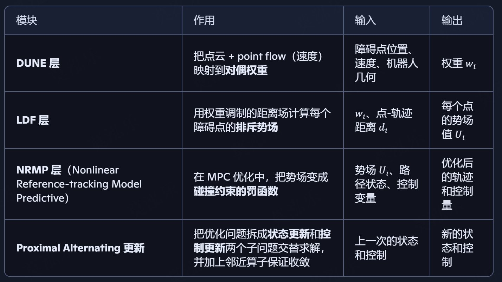
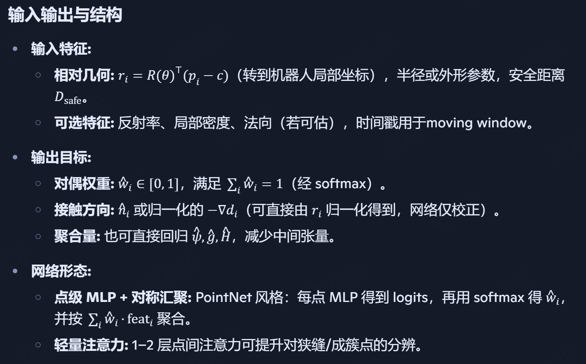
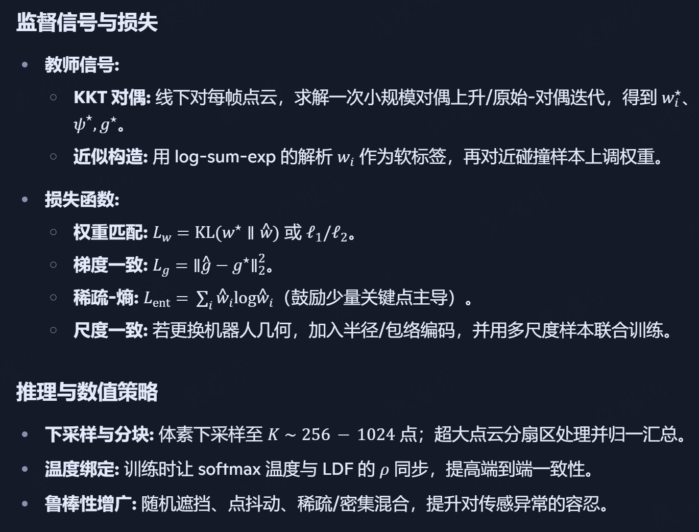
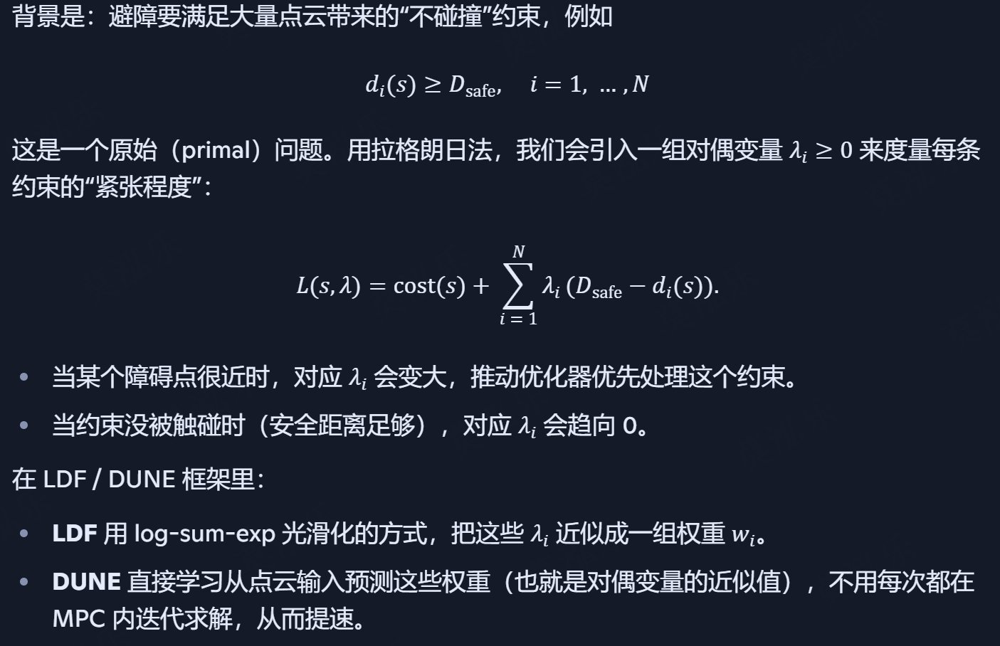
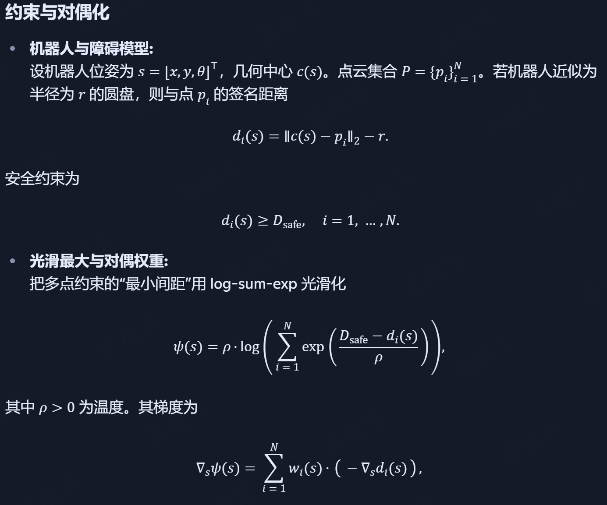
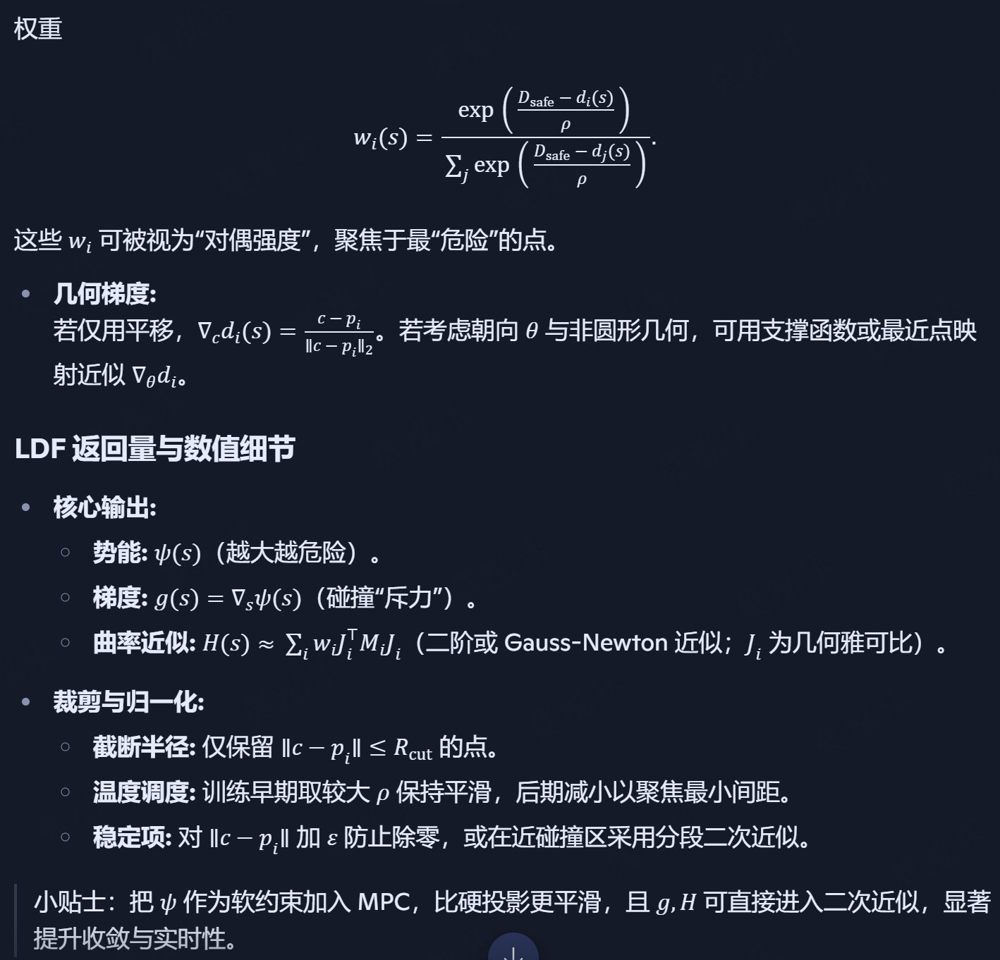
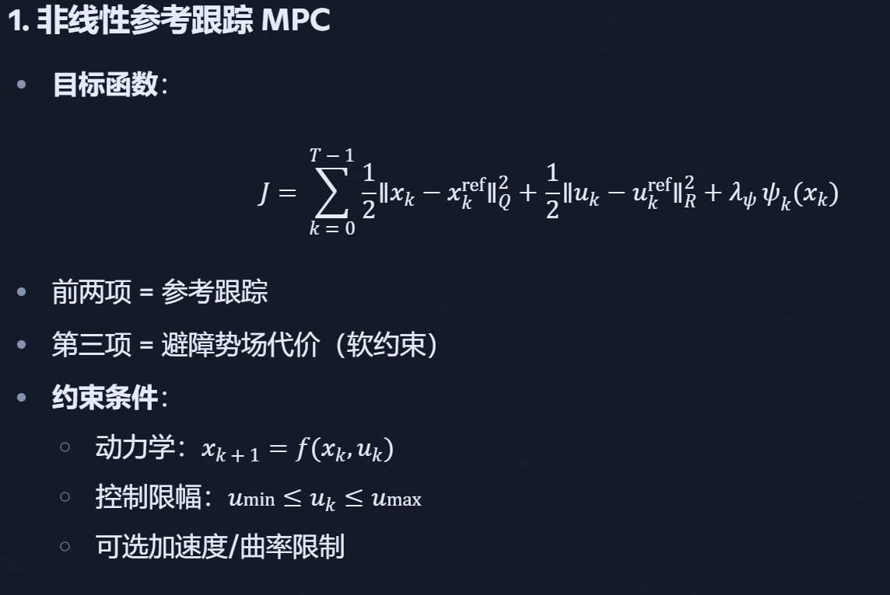
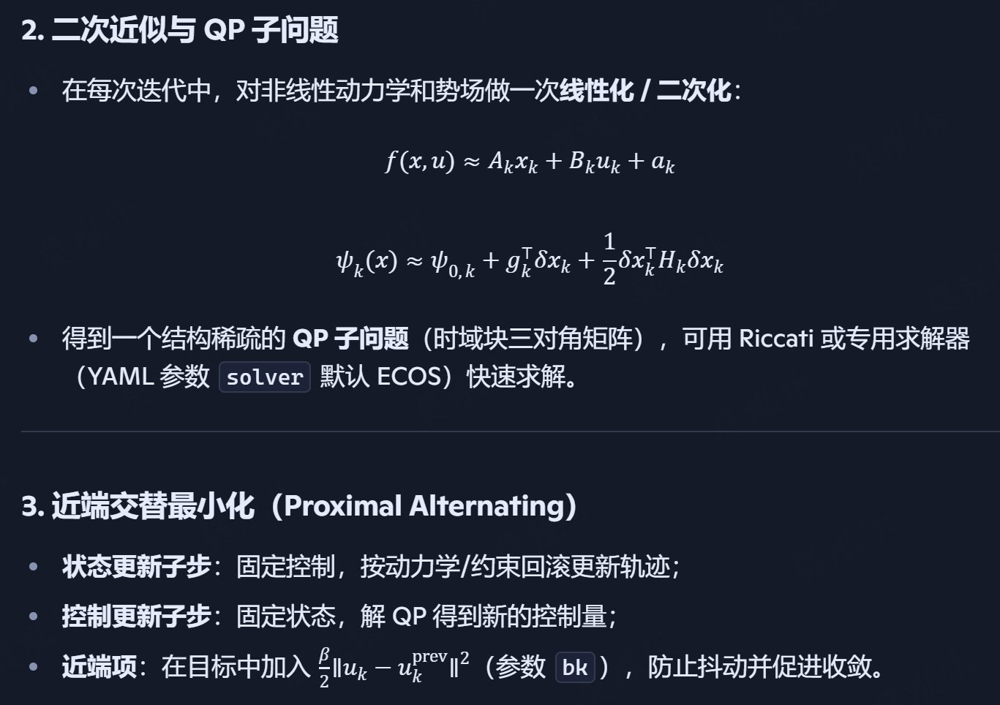

# NeuPAN
NeuPAN: Direct Point Robot Navigation with End-to-End Model-based Learning

- Paper: https://arxiv.org/abs/2403.06828
- Code: https://github.com/hanruihua/NeuPAN

## 方法

### Point Flow
形式：每个障碍点的速度

计算方式：
- 如果是固定 ID 的障碍（如仿真），直接做差；
- 若原始点云无显式对应关系，可用最近邻匹配或点云配准（ICP/NDT）获得对应点，再求位移；
- 在 3D LiDAR 下，可先投影到地面平面再计算。

动态场景中安全导航，仅靠静态距离约束会对“迎面来物体”反应滞后。 point flow 把障碍点的运动趋势编码进 LDF/DUNE 中：
- 位置和速度送进DUNE网络，学习动态权重$w_i$
- 速度越大且指向机器人方向，权重越大，速度远离机器人权重减小

### DUNE 网络（LDF高效近似）
作用：把原本需要迭代求解的对偶问题“展开”为一个浅而快的网络近似（DUNE），输入与障碍相关的几何特征，直接给出逼近的对偶变量/距离特征，兼顾速度与精度

在实时闭环里，真正的对偶优化迭代次数太宝贵；用 DUNE 近似能把优化“蒸馏”为一次前向，稳住 30Hz 的规划频率

DUNE 用一个轻量、置换不变的点集网络，直接近似"对偶权重/接触几何"，避免在闭环里迭代求对偶

### 局部距离场（LDF）
思想：把“与每个障碍点的安全距离约束”转为对偶变量定义的局部距离场，既刻画风险程度又支持并行与可微，从而将“多点约束”压缩成紧凑、可学习的表征

对每个点云点，LDF 输出一组紧邻对偶解（如风险权重与方向信息），数值越“紧”，表示越接近碰撞边界；这让后续控制优化能在一次前向中处理大量碰撞约束

LDF 把"点云中的大量碰撞约束"压缩成一个紧凑、可微、可并行的风险势场及其导数，用来驱动后续的近端-MPC 更新

### NRMP（Nonlinear Reference‑tracking Model Predictive）
NRMP 是 PAN 的“大脑”： PAN 把整个近端优化过程展开成网络层，每一层都包含一个 NRMP 子模块，用于在 MPC 框架下更新轨迹和控制量。

核心任务：跟踪参考路径（reference‑tracking）+ 满足机器人动力学 + 满足碰撞安全（来自 LDF/DUNE 势场）的约束。

特色：非线性动力学 + 实时二次近似（SQP/QP）求解，且支持对避障部分用势场软约束，保持可微性。

输入：当前状态（位姿速度）、初始路径、动力学模型、避障势场、权重参数

输出：控制序列（速度指令）、轨迹状态

#### 近端交替最小化

近端交替最小化（Proximal Alternating Minimization）是一类分步求解复杂优化问题的算法思想，在 NeuPAN 里的 PAN（Proximal Alternating‑minimization Network）就是按这个思路展开的。

你可以把它想成两个人在搬大石头：一个人固定石头的一边，让另一边可以先动；然后交换角色，让另一边固定，第一边动；在来回几轮之后，整块石头就被挪到了目标位置。

在数值优化里，这个“固定一边、优化另一边”的循环就是交替最小化（Alternating Minimization）：

拆成两个或多个子问题：比如在 NRMP 层里，状态变量（轨迹）和控制变量（速度/转向）会分开看。交替求解：固定状态去优化控制，再固定控制去优化状态，反复迭代。

而“近端”是为了让每一步的更新更稳，防止“走得太快”导致震荡或发散。在子问题的目标函数里，加一个近端正则项：

$$ \frac{\beta }{2} \left \| z-z_{prev} \right \| ^{2} $$

$z$是当前要优化的那组变量，$z_{prev}$是上一次的值，$\beta$是在 的 bk 系数。

这个额外的“黏性”会让新解不至于离旧解太远，就像拉根橡皮筋牵着它，既能收敛，又能抑制数值噪声。

在 NeuPAN 的上下文里：
- 状态更新步：满足动力学、尽量跟踪参考轨迹；
- 控制更新步：在控制限幅内，解 QP 子问题，综合避障势场和轨迹跟踪；
- 近端正则：确保每一轮变化平滑，利于实时运行和鲁棒性。

## 流程

感知 -> 对偶近似 -> 近端优化

1. 输入：2D障碍点集

2. 几何预处理：转机器人坐标、下采样、过滤远点

3. DUNE（Dual Network Estimator）
    - 输入：当前帧点云的局部几何（相对坐标、半径、安全距离等）+ 机器人几何参数
    - 输出：每个点的对偶权重、聚合后的避障势场信息：势能、梯度、曲率

4. PAN（Proximal Alternating-minimization Network）
    - 在 MPC 框架内，把参考轨迹、动力学模型和来自 DUNE 的避障势场信息结合起来
    - 输入：初始路径、当前状态（位姿速度）、动力学模型、避障势场信息
    - 输出：未来T步的控制量

把原始的点云避障约束（数千个点）转化成了 神经正则项 Cr(S, M, L)，直接加到 MPC 的代价函数里。优化目标：

$$ \min_{S,U\in F}C_0\left ( S,u \right )  + C_r\left ( S,M,L \right ) + C_1\left ( d \right )  $$

其中：
- $S$: 状态序列, 包含优化时域$H$中每个时刻状态向量（位置、速度、朝向等）
- $U$: 控制序列（速度、转向角、加速度等）
- $F$: 满足离散时间运动学模型方程和控制/加速度约束的所有 $S, U$ 的集合
- $M$: LDF中的$\mu_i$, 来自强对偶变换的不等式约束拉格朗日乘子，反映障碍点和机器人最近边的匹配关系及距离方向信息
- $L$: LDF中的$\lambda_i$, 等式约束拉格朗日乘子，表示障碍点与最近机器人边界分离超平面的法向量
- $C_0$：轨迹跟随 + 速度保持成本（平衡轨迹形状与速度目标）
- $C_r$：LDF 导出的避障正则化项，相当于“势能”项，鼓励轨迹远离障碍（梯度指引方向，曲率约束平滑）
- $C_1$：动态安全距离调节（稀疏化距离正则，提升在不同环境密度下的适应性）

DUNE 输出的 $ \left ( \mu_i, \lambda_i \right )  $ 经过筛选（只取最近的几个点）。在$C_r$中，对每个点计算距离罚值 $ \min \left ( I\left ( \cdot  \right ), 0  \right )^2 $ (势能)。梯度 $ E \left ( \cdot \right )$ 参与正则，指导优化器改变 $S, U$ 的方向。这些项共同让优化器在未来时域$H$内，生成既跟随参考轨迹又避开障碍的轨迹。

PAN迭代流程：
1. Q1 子问题（感知）： 固定当前预测轨迹 $S, U$，由 DUNE 将点云映射成 LDFs（含势能/梯度/曲率）
2. Q2 子问题（控制）： 固定 LDFs，求解加了 $C_r$ 的 MPC 问题，生成新轨迹/控制序列
3. 交替迭代数轮（通常 3 轮内收敛），形成闭环感知-控制耦合
