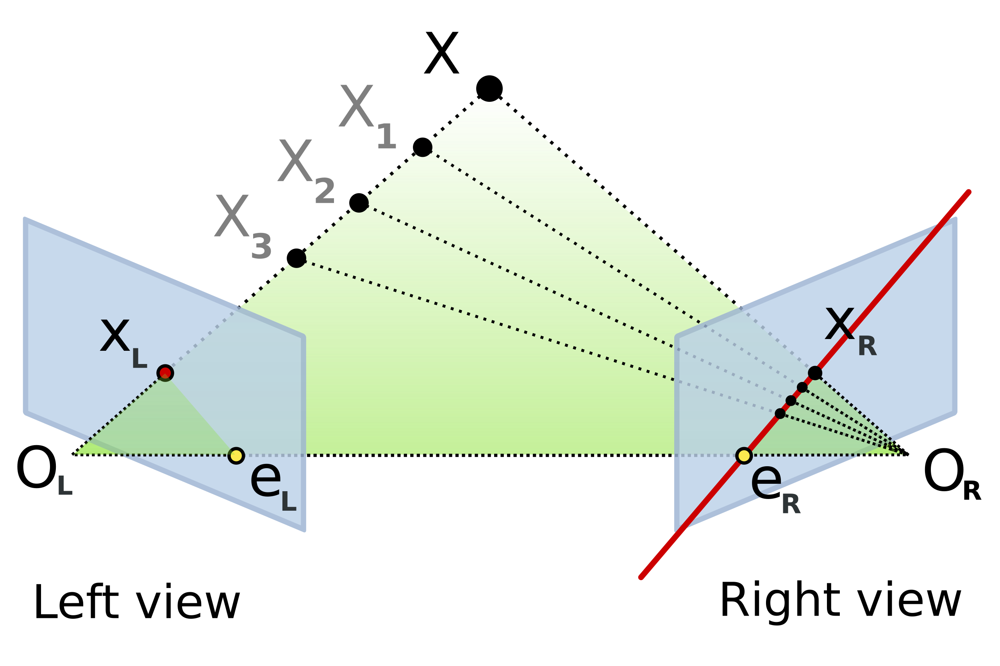

# Camera Preliminary

## 坐标系
### 世界坐标系

三维点 

$$ X_W = \left [ X\space Y \space Z \space  1 \right ] ^T $$

### 相机坐标系

- 原点：相机光心
- x轴：水平向右（从相机自身视角看）
- y轴：竖直向下（从相机自身视角看）
- z轴：沿着相机的光轴指向前方，即镜头看出去的方向

通过外参 $ R, t $ 将世界点变换到相机坐标系

$$ X_c = RX + t $$

### 归一化像平面 Normalized Image Plane

透视投影到焦距为 1 的平面

$$ x = \frac{X_c}{Z_c}, \quad y = \frac{Y_c}{Z_c} $$

其中: 
- $X_c, Y_c, Z_c$ : 三维点在相机坐标系中的坐标（单位通常是米或毫米）、$Z_c$是空间点在相机坐标系中的深度
- $ x,y $ : 归一化平面上的坐标，单位是“以焦距为 1 的长度单位”，此时没有考虑像素的缩放和平移
- $ \frac{X_c}{Z_c} , \frac{Y_c}{Z_c} $: 透视投影关系，即点的横纵位置除以深度，表示投影到距离相机原点 1 个单位焦距的成像平面

理想针孔相机的成像平面距离投影中心为 1 个单位长度（焦距）

归一化平面是一个理想针孔相机的成像结果，没有畸变，也没有传感器像素网格的影响。归一化像平面处理的是“几何投影”，对应空间比例

### 像素坐标系 Pixel Coordinate System

- 原点在图像左上角
- x轴：水平向右
- y轴：竖直向下
- z轴：向前

由内参矩阵 $ K $ 将归一化坐标映射到像素

$$ s \begin{bmatrix} u \\ v \\ 1 \end{bmatrix} =
\mathbf{K}
\begin{bmatrix}
\mathbf{R} & \mathbf{t}
\end{bmatrix}
\begin{bmatrix} X_w \\ Y_w \\ Z_w \\ 1 \end{bmatrix} $$

其中：

$$ \mathbf{K} = 
\begin{bmatrix}
f_x & s & c_x \\
0 & f_y & c_y \\
0 & 0 & 1
\end{bmatrix} $$

- $ u, v $: 像素坐标系中的横纵坐标（单位：像素）
- $ s $: 整体缩放因子（归一化平面到像素坐标的齐次比例系数）
- $ K $: 相机内参矩阵
    - $ f_x = f/m_x $: 水平方向焦距，单位是像素（即物理焦距乘以水平方向像素密度）
    - $ f_y = f/m_y $: 垂直方向焦距，单位是像素
    - $ m_x, m_y $: 为像元尺寸（pixel size）在水平方向和垂直方向上的物理长度，单位一般是毫米/像素或微米/像素
    - $ s $: 主轴倾斜系数（skew），当成像平面横纵轴不垂直时非零，大部分相机可近似为0
    - $ c_x, c_y $: 主点坐标，即光轴与成像平面交点在像素坐标系中的位置（通常接近图像中心）

像素坐标也可写为：
$$ u = f_x \cdot x + c_x, \quad v = f_y \cdot y + c_y $$

$ f_x, f_y $ 是比例因子，用来把真实世界的物理距离（mm）投影换算成像平面上的像素距离

像素坐标系处理的是“成像传感器采样与像素网格映射”，对应像素单位

## 透视投影 & 畸变模型

### 无畸变投影

$$ s \begin{bmatrix} u \\ v \\ 1 \end{bmatrix} =
\begin{bmatrix}
f_x & s & c_x \\
0 & f_y & c_y \\
0 & 0 & 1
\end{bmatrix}
\begin{bmatrix}
\mathbf{R} & \mathbf{t}
\end{bmatrix}
\begin{bmatrix} X_w \\ Y_w \\ Z_w \\ 1 \end{bmatrix} $$

### 径向与切向畸变（常用 Brown–Conrady 模型）

先计算归一化坐标与半径：
$$ x = \frac{X_c}{Z_c}, \quad y = \frac{Y_c}{Z_c}, \quad r^2 = x^2+y^2 $$

径向畸变：
$$ x_r = x\,(1 + k_1 r^2 + k_2 r^4 + k_3 r^6), \quad y_r = y\,(1 + k_1 r^2 + k_2 r^4 + k_3 r^6) $$

切向畸变：
$$ \Delta x_t = 2p_1xy + p_2(r^2 + 2x^2),\quad \Delta x_t = 2p_1xy + p_2(r^2 + 2x^2) $$

合成畸变后的归一化坐标:
$$ \tilde{x} = x_r + \Delta x_t,\quad \tilde{y} = y_r + \Delta y_t $$

映射到像素：
$$ \begin{bmatrix} u \\ v \\ 1 \end{bmatrix} =
\mathbf{K}
\begin{bmatrix} \tilde{x} \\ \tilde{y} \\ 1 \end{bmatrix} $$

（可选）薄棱镜畸变项：
$$ \Delta x_p = s_1 r^2 + s_2 r^4, \quad \Delta y_p = s_3 r^2 + s_4 r^4 $$

## 单应矩阵
在三维世界里，如果两个相机都拍了同一个平面（比如棋盘格标定板），那么这个平面上的点从一张图到另一张图之间的映射，不需要考虑深度变化，可以用一个 3×3 的矩阵直接描述。这个矩阵就是单应矩阵（Homography）。它处理的是齐次坐标，所以只关心方向关系，不在乎整体缩放

单应矩阵其实把几个几何因素揉在了一起：
- 相机的内参（焦距、主点等）
- 相机在两次拍摄中的姿态变化（旋转和平移）
- 平面的空间位置和朝向（法向量和到相机的距离）

组合起来，它能回答：“这个平面上的点在另一张图里应该落在哪”

在针孔相机模型下，如果两个相机拍摄的是同一个平面，那么这个平面在两幅图像中的投影之间存在一个唯一的单应矩阵。它是二维平面到二维平面的映射，保持直线为直线，但不保持长度、角度等度量性质。

把第一张图像的平面“拉伸、旋转、透视变形”后，就能和第二张图像的平面区域对齐。这种变换就是单应性变换。

### 定义

$ 3 \times 3 $可逆矩阵，它描述了同一平面上的点在两个不同视角的图像之间的射影变换关系：

$$ q_2 \propto H q_1 $$

其中：
- $ q1 = \left [ u_1, v_1, 1 \right ]^{\mathrm{T}} $ 是第一张图像中的点（齐次坐标）
- $ q2 = \left [ u_2, v_2, 1 \right ]^{\mathrm{T}} $ 是第二张图像中的对应点
- $ \propto $ 表示两边相差一个非零尺度因子（齐次坐标的特性）

世界坐标系中的平面方程：

$$ n^{\mathrm{T}}P + d = 0 $$

其中 $n$ 是平面法向量，$d$ 是相机到平面的距离

相机投影模型：

$$ sq = K \left [ R \mid t \right ] P $$

对同一平面上的点，消去深度 $z$ 后，可以得到：

$$ H_{21} = K_2 \left ( R_{21} + \frac{t_{21}n^{\mathrm{T}}}{d}  \right ) K_1^{-1} $$

这就是单应矩阵的解析形式

单应矩阵有 9 个元素，但由于齐次坐标的尺度不唯一，只有 8 个自由度。每对匹配点提供 2 个独立方程，因此至少需要 4 对非共线的匹配点才能求解 $H$。实际应用中会用更多点并结合 RANSAC 等方法来提高鲁棒性。

## 本质矩阵 Essential Matrix

本质矩阵是基本矩阵在归一化图像坐标下的特殊形式。本质矩阵的核心作用是描述空间中一点在两幅图像之间的几何约束关系。

### 定义

在归一化相机坐标系（像素坐标经 $ K^{-1} $ 内参矩阵转化）下，有：
$$ x^{'T}Ex = 0 $$

$x, x^{'}$ 为归一化齐次坐标, $ E $ 为 $ 3 \times 3$ 矩阵

计算公式:
$$ E = \left [ t \right ]_\times R $$

其中:
- $ R $: 从第一相机坐标系旋转到第二相机坐标系的旋转矩阵
- $ t $: 两相机光心的相对平移向量
- $ \left [ t \right ]_\times $: 由$t$构造的反对称矩阵，用于叉乘运算

### 性质

- 秩为 2
- 两个非零奇异值相等，第三个奇异值为 0
- 仅由外参（R, t）决定，与内参无关。
- 自由度为 5（R 的 3，自由的 t 方向 2）

### 用途

从 E 可分解得到相对姿态（R, t 方向）

双目标定后，E 直接可由外参计算，也可由特征匹配估计再分解

## 基础矩阵 Fundamental Matrix

在像素坐标系（未去内参）下，对极几何约束为:
$$ x^{'T}Fx = 0 $$

$x, x^{'}$ 为图像坐标（齐次形式 $ \left [ u, v, 1 \right ]^\mathrm{T}  $）

与本质矩阵转换：
$$ F = K^{'-\mathrm{T}} E K^{-1} $$

$K, K^{'}$为左右相机的内参矩阵

### 性质

- 秩为 2
- 自由度为 7（因为整体尺度无关，9 元素减 1 个比例约束，再减去秩约束）
- 由内参 + 外参共同决定

### 用途
不需要已知内参即可直接通过特征匹配估计 F。

用于单应分解、极线校正、匹配约束等。

## PnP Perspective-n-Point

已知 3D–2D 对应关系 → 求单个相机位姿

### 定义

已知若干个三维点（3D）与它们在图像上的二维投影点（2D）的对应关系，求解相机的位姿（位置 + 朝向）问题

输入：
- 至少 3 对 3D–2D 对应点（$R, t$ 共12个参数至少需要3对点，常用 4 点或更多来提高稳定性）
- 相机的内参矩阵（焦距、主点等）

### 常见算法
- P3P：最少 3 对点求解，可能有多个解
- EPnP：高效求解多点情况
- RANSAC-PnP：结合 RANSAC 剔除外点，提升鲁棒性

## 对极几何 Epipolar Geometry

已知 2D–2D 对应关系（两视图） → 求相机间相对位姿

### 定义

[Wiki](https://zh.wikipedia.org/zh-cn/%E5%AF%B9%E6%9E%81%E5%87%A0%E4%BD%95)

描述两个相机视图（或同一相机在两个时刻）之间的几何约束关系

#### 极点（Epipole）
一个相机光心在另一相机成像平面上的投影

由于相机镜头的光学中心是不同的，因此每个相机中心都投影到另一个相机图像平面的不同点上。这两个图像点用 $ e_L $ 和 $ e_R $ 表示，称为对极点。两个对极点 $ e_L $ 和 $ e_R $ 在两个相机各自的像平面中，并且落在两个光学中心 $ O_L $ 和 $ O_R $ 的连线上。

#### 极线（Epipolar Line）
某个空间点在另一幅图像中可能出现的位置轨迹

线 $ O_L $  $ X_L $ 被因为与左相机中心重合而被左相机视为一个点。但右相机将这条线视为其图像平面中的一条线。右摄像机中的那条线（ $ e_R $ $x_R$ ）就称为对极线。对称地，右相机视线 $ O_R $ X为一个点，而被左相机视为对极线（ $ e_L $ xL）。

#### 极平面（Epipolar Plane）
由两个相机光心和空间点构成的平面

对极线是3D空间中点X的位置的函数，其随着X的变化，在两个图像中都会生成一组对极线。由于线 $ O_L $ X通过透镜 $ O_L $ 的光学中心，因此右图中相应的对极线必须通过 $ e_R $ （并且对应于左图中的极线）。一幅图像中的所有对极线都包含该图像的对极点。

## 重投影误差

在计算机视觉任务中，如平面单应矩阵和投影矩阵的计算，通常会利用重投影误差来构建代价函数，并通过最小化这个代价函数来优化相应的矩阵。重投影误差不仅考虑了单应矩阵的计算误差，还考虑了图像点的测量误差，因此能够提供更高的精度。

### 定义

重投影误差指的是真实三维空间点在图像平面上的投影（即图像上的像素点）与重投影（通过计算得到的像素点）之间的差值。

$$ e = \sqrt{\left ( u_{\mathrm{proj}} - u_{\mathrm{obs}}  \right )^2 + \left ( v_{\mathrm{proj}} - v_{\mathrm{obs}}  \right )^2 }  $$

### 计算

真实位置：先测量一些点在图像中的位置（像素坐标）

预测位置：根据当前估计的相机模型，把对应的三维世界点投影到图像上

重投影误差就是真实位置和预测位置的差距（通常取二维欧氏距离）

### 双目

以ORB为例

1. 利用双目匹配（同一时刻左、右相机的点对）进行三角化，得到世界坐标系或相机坐标系下的 3D 点
2. 将 3D 点通过已估计的相机运动（R,t）转换到下一帧左（或右）相机的坐标系
3. 利用相机投影模型（包含畸变）将转换后的 3D 点投影到像素平面
4. 与下一帧中实际检测到的特征点像素坐标对比, 构建重投影误差
5. 对所有匹配点求均方根（RMS）或平均值，作为该两帧间的总体重投影误差
6. 迭代求解(高斯-牛顿、LM， Ceres Solver、g2o、Sophus)

特征点匹配、迭代可插入RANSAC剔除异常点

