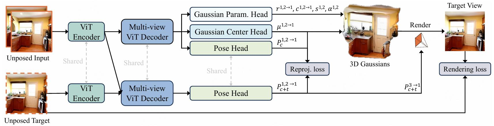

# No Pose at All: Self-Supervised Pose-Free 3D Gaussian Splatting from Sparse Views

Paper: [https://arxiv.org/abs/2508.01171](https://arxiv.org/abs/2508.01171)

Code: [https://github.com/ranrhuang/SPFSplat](https://github.com/ranrhuang/SPFSplat)

## 框架

### 图像特征编码器 Image Feature Encoder

在完全无位姿的条件下，需要同时估计相机姿态和3D 高斯场景表示，所以它的特征编码器不仅要提取外观信息，还要保留与几何、空间位置高度相关的特征，方便后续的位姿回归与几何重建

结构：基于 MASt3R 的 CNN + Transformer 混合架构

输入：原始 RGB 图像

输出：局部特征图（用于几何建模）、全局特征向量（用于位姿预测）

增强机制：引入 RoPE（Rotary Position Embedding）编码空间位置，保留图像中物体的相对空间关系

#### 结构

输入2～3 张（训练时）或更多（推理时）的 RGB 图像，通常会预先 resize 到 $256\times256$

骨干网络：
- 采用 MASt3R 预训练模型作为底层 backbone，它结合了 CNN 的局部纹理捕获优势与 Transformer 的全局建模能力。
- 前几层卷积（Conv stem）提取低层次特征（颜色、纹理边缘）。
- 中间和高层使用多头自注意力（Multi-Head Self-Attention）进行全局特征建模

##### RoPE
RoPE（Rotary Position Embedding）直接嵌入到注意力机制中，为每个 patch 的 Query/Key 增加可旋转位置相位信息。

作用：在不增加维度的情况下保留相对几何关系。对旋转、视角变化更加稳健（关键，因为训练和推理时输入视角差异大）。

##### 输出分支
局部特征输出分支：关注像素级和小范围 patch 的纹理与边界信息。常用于可微渲染器的颜色细节恢复。

全局特征输出分支：聚合全图信息，捕捉跨视角的一致结构。为相机位姿预测模块提供全局上下文信号。

多尺度特征融合（Feature Pyramid）
将不同分辨率层级的特征拼接/融合（FPN-like 设计）。

优势：
- 高分辨率层 → 精细纹理
- 低分辨率层 → 场景全局几何

这样既能服务高斯点位置的细腻调优，又能保证相机姿态预测的稳定性。

### 相机位姿预测器 Pose Estimator

目标：为每张输入图像预测其相对于 canonical space 的相机外参 $ T_i \in SE\left ( 3 \right ) $，用于把 canonical 中的 3D 高斯投影到图像平面参与可微渲染与损失计算

输入：来自共享的多视图视觉编码器（ViT/MASt3R 特征）的全局与跨视图聚合特征，携带外观与几何一致性线索

输出：相机外参（旋转 + 平移）

参数化方式：旋转：李代数 / 四元数、平移：三维向量

优化机制：作为可学习参数参与反向传播，由渲染损失驱动更新

初始化策略：随机初始化或基于图像匹配的粗估计（可选）

#### 结构

共享骨干提取多视图特征（以 ViT 编码器聚合多视几何），在此基础上接入一个轻量级的位姿回归头（MLP 形式）直接输出每视图外参

#### 训练

##### 像素级渲染重建损失

以可微高斯渲染器在预测位姿下合成视图，与真实图像比较；使用 L2 与感知型指标（如 LPIPS）联合，直接将梯度回传到位姿头与 3D 高斯参数，从而端到端驱动位姿学习

##### 几何一致性（重投影）损失

将跨视图对应的 3D 高斯中心或特征点，经预测位姿重投影回原视图，约束其与观测像素位置一致；该项为位姿提供强几何对齐信号，抑制“用错误几何/位姿相互补偿”的退化解

##### 多视图特征聚合

共享的多视图 ViT 编解码结构在特征层面融合上下文，有助于在稀疏、低重叠条件下稳定出可解释的相对位姿与场景结构联合表示

### Canonical Space 构建器 3D Gaussian Generator

目标：构建一个统一的场景表示空间

表示形式：一组 3D 高斯点，每个点包含：坐标位置 $(x, y, z)$、方差矩阵 $\Sigma$（控制形状与模糊）、颜色向量 $(r, g, b)$、不透明度 $\alpha$

优势：所有视角共享同一个空间表示、避免多视角间几何漂移
