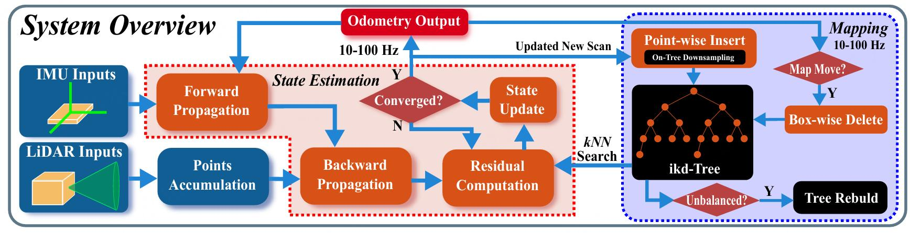

# FAST-LIO2: Fast Direct LiDAR-inertial Odometry

Paper: [https://arxiv.org/abs/2107.06829](https://arxiv.org/abs/2107.06829)

特点：
1. 直接点云配准：不再提取边缘/平面等特征点，而是直接将原始点云与地图匹配
2. 增量式 k-d 树（ikd-Tree）支持动态插入、删除、重平衡，并可在树上直接下采样
3. 紧耦合迭代卡尔曼滤波（IKF）：融合 IMU 数据进行运动畸变补偿，使用优化后的卡尔曼增益计算公式，降低计算复杂度

## 框架概览



1. 数据采集: IMU（如 200 Hz）采样角速度与加速度。LiDAR以 10–100 Hz 扫描环境，输出按时间顺序采样的原始点云

2. 前向传播（Forward Propagation）: 每到一个 IMU 采样点，根据系统动力学模型更新状态预测（位置、速度、姿态、IMU 偏置、LiDAR-IMU外参等）

3. 点云积累: 将一个扫描周期内的 LiDAR 点累积成一帧“扫描”数据（scan）

4. 后向传播（Backward Propagation）: 基于 IMU 数据推算每个 LiDAR 点在扫描周期内的相对位姿，消除运动畸变，使整帧点云等效为在扫描结束时刻采集

5. 测量更新（Iterated Update）: 以地图中的邻近点拟合局部平面，建立测量残差方程。使用迭代卡尔曼滤波（IKF）在流形空间上优化状态，直到收敛。

6. 地图更新（Mapping）: 将配准后的新点云插入 ikd-Tree，同时在树上执行空间下采样，保证地图规模受控。当 LiDAR 探测范围接近当前地图边界时，执行 box-wise 删除 移除远端旧点，实现滑动地图管理。

```
初始化状态 x0 与 ikd-Tree 地图
循环：
    1. 接收 IMU 数据并前向传播状态
    2. 接收一帧 LiDAR 扫描
    3. 后向传播补偿运动畸变
    4. 对每个点：
         - 在 ikd-Tree 中找最近邻
         - 拟合平面，形成测量残差
    5. 迭代更新状态，直至收敛
    6. 将新点云插入 ikd-Tree（下采样）
    7. 如果地图需滑动，执行 box-wise 删除
输出：当前最优位姿与更新后的地图
```

## iEFK模型

### 运动与测量模型

设世界系为G，IMU系为I，雷达系为L

状态量： $x = [R_{GI}, p_{GI}, v_{GI}, b_g, b_a, g^G, R_{LI}, p_{LI}]$ 包括 IMU 在世界系的姿态/位置/速度、陀螺与加速度计偏置、重力、LiDAR-IMU 外参等。

### 点的时域去畸变

原始点 $p_i^L\left(t_i\right)$ 采样在扫描周期内不同时间 $t_i$。用IMU积分得到 $ T_{GI} \left(t_i\right) $ 并“后向传播”到帧末时刻，将每个点等效到同一时间面。

## ikd-Tree

优势：
- 增量更新快: 支持逐点插入、删除，不必像传统 k‑d tree 那样重建整个结构。新数据到来时仅更新局部，计算开销小
- 动态自平衡: 随着插入/删除，树会局部重构保持平衡，避免查询性能退化
- 内建降采样: 在构建或更新时，可以直接在节点级别做 Voxel/Grid 下采样，节省内存和计算。对 SLAM 地图的稠密点云来说很实用

1. 数据结构: 节点存储点坐标、分割维度、子节点指针。同时维护体素索引（用于降采样）。

2. 插入过程: 按 k‑d tree 的规则沿分割维递归定位插入位置。检查目标体素是否已有近似点，若有可丢弃或替换。

3. 删除过程: 找到目标点所在节点，若删除导致局部数据稀疏，则触发局部重建。

4. 自平衡机制: 每个节点维护子树大小；当平衡度超阈值时，提取子树点集，重新构建该子树。

5. 查询接口: 保留标准的 kNN / Radius Search 接口，便于和优化器或配准模块对接。

## 直接点云配准

FAST-LIO2抛弃了“先提取边缘/平面等几何特征再匹配”的两阶段范式，转而对每个原始点直接建立“点到局部隐式面”的约束，并在紧耦合的迭代卡尔曼滤波里一次性求解位姿与IMU相关状态

### 平面拟合与法向

#### 搜索结构

在ikd_Tree里用半径或最近邻搜索（通常 k=5~20）快速找到周围的地图点，即领域

根据实际点密度（不同 LiDAR 的线数、扫描模式）来调节邻域大小与最近邻数，兼顾精度与实时性

对邻域 $N_i$ 计算质心 $\bar{p}_i$ 和协方差

$$ C_i = \sum_{p\in N_i} \left ( p-\bar{p}_i  \right )  \left ( p-\bar{p}_i  \right )^\mathrm{T} $$

#### 平面判定

求协方差矩阵特征值 $ \lambda_1 \ge \lambda_2 \ge \lambda_3 $

若 $ \frac{\lambda_3}{\left ( \lambda_1 \ge \lambda_2 \ge \lambda_3 \right ) } $ 小于某个阈值（比如 0.01～0.03），说明这些点几乎共面，可用于平面拟合。阈值越小，筛选越严格，抗动态性和噪声能力越高，但有效点会减少

最小特征值对应的特征向量即法向 $n_i$, 平面过点 $ \bar{p}_i $

#### 过滤

剔除到平面残差过大的点，防止动态物体或错误匹配污染平面。

有时还会要求邻域点的空间分布足够分散（避免全挤在一条线上），否则放弃该邻域

### 点到平面残差

将点变换到世界系:

$$ p_i^G = R_{GI}\left ( R_{LI}p_i^I + p_{LI} \right ) + p_{GP} $$

残差定义为:

$$ r_i = n_i^\mathrm{T} \left ( p_i^G  - \bar{p}_i\right )  $$

采用稳健核与基于可平面性/距离的权重得到加权残差 $ \tilde{r}_i = \sqrt{w_i}r_i  $

## 雅可比

在滤波或优化求解中，我们是通过残差（点到平面的距离）来调整位姿等状态的。残差本身是非线性的，因为它涉及旋转、平移、外参等复合变换。为了能在迭代求解中“线性近似”残差随状态的变化，就需要对残差对各个状态分量的敏感度进行求导，这些一阶导数就是 雅可比矩阵。有了雅可比，迭代卡尔曼滤波（IKF）就能把问题转化成线性的更新方程，高效地求解状态增量。

### 对位姿和外参的雅可比

令小旋量 $\delta \theta$ 对应 $ R \leftarrow R \mathrm{exp}\left( \delta \theta \right)^\wedge $, 一阶近似为:

$$ \delta r_i \approx n_i^\mathrm{T} \left ( -R_{GI}R_{LI}\left [ p_i^L \right ]_\times \delta \theta_{GI} + \delta p_{GI} -R_{GI}\left [ R_{LI}p_i^L \right ]_\times \delta \theta _{LI}+ R_{GI} \delta p_{LI}  \right ) $$

对 $ v_{GI}, b_g, b_a, g^G $ 的雅可比通过IMU预积分链式传播得到

### 量测协方差建模

由局部平面拟合误差、IMU去畸变不确定性和传感器噪声叠加估计 $ \sigma_i^2 $, 形成对角的 $ R = \mathrm{diag}\left( \sigma_i^2 \right) $

## 流形线性化

状态里不仅有平移 $t \in R^3$ 这种普通欧氏空间的变量，还有姿态旋转，这类变量属于 SO(3) 流形（一个非欧空间）。如果直接用常规线性化，会破坏旋转矩阵的正交性，引入数值误差。在流形上线性化，就是用李群/李代数的方法，在切空间上做近似，然后再用指数映射回旋转群，这样保证旋转运算是物理上正确的。

### 状态李群/李代数表达

旋转变量属于特殊正交群 $SO(3)$，它是一个曲面流形，不能像普通向量那样直接做加减。

引入李代数 $so(3)$: 用一个三维小量 $\delta \theta \in R^3$ 表示微小旋转，指数映射可将它映射回 $SO(3)$:

$$ R \leftarrow R \mathrm{exp}\left( \delta \theta^\wedge \right) $$

$\left( \cdot \right)^\wedge$ 是向量到反对称矩阵的映射

### 切空间一阶展开

在线性化之前, 点到平面残差为:

$$ r_i = n_i^\mathrm{T} \left [ R_{GI}\left ( R_{LI}p_i^L + p_{LI} \right ) + p_{GI} - \bar{p}_i  \right ]  $$

在当前估计 $R^*$ 附近，对小扰动 $\delta \theta$ 做一阶泰勒展开：

$$ R \exp \left ( \delta \theta^\wedge  \right )  \approx R\left ( I + \delta \theta^\wedge    \right ) $$

把这个近似代入残差公式，对各状态量求导，得到雅可比矩阵:

$$ \frac{\partial r_i}{\partial \delta \theta_{GI}} \approx -n_i^\mathrm{T}  R_{GI}R_{LI}\left [ p_i^L \right ]_\times $$

类似地可以推到对 $\delta \theta_{LI}$、平移、外参等的偏导 

### 更新迭代

滤波或优化求出状态增量 $ \delta x = \left [ \delta \theta_{GI}, \delta p_{GI}, ...\right ] $ 后,对旋转部分在李代数里指数映射“加”, 平移、速度等欧氏量则直接加上增量。这样更新完旋转，矩阵依然正交且行列式为 $+1$，几何意义完好。

用新状态重新计算残差 → 再在流形切空间线性化 → 再求解增量，直到收敛
